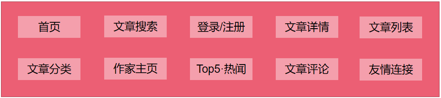
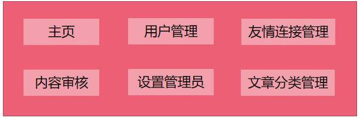
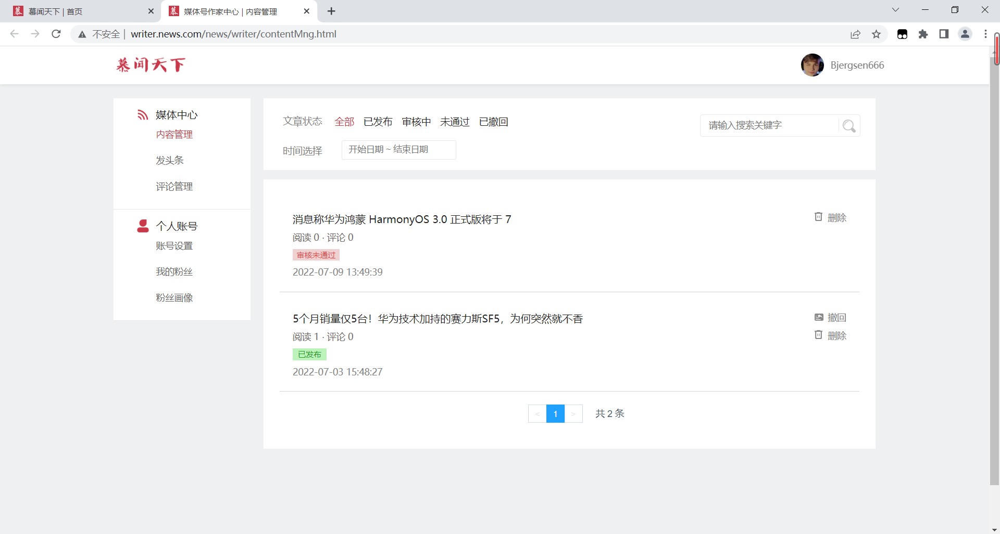
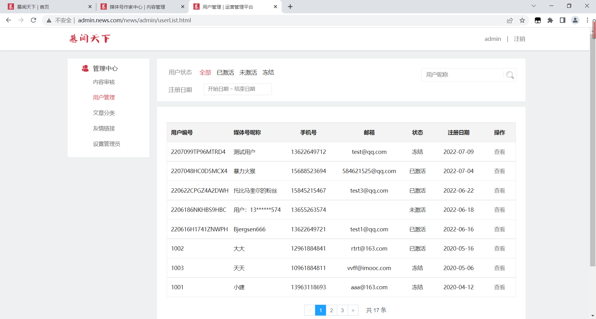

# news

#### 项目介绍

- 该项目是一款基于用户关系信息分享、传播以及获取的通过关注机制分享简短实时信息的广播式的社交媒体、网络平台。

- 功能模块图：

  - 门户首页

    

  - 作家中心

    

  - 后台管理中心

    

#### 技术选型

- 核心框架：SpringBoot、MyBatis、SpringCloud
- 数据库：Mysql、Redis、MongoDB
- 中间件：RabbitMQ、ElasticSearch、Nginx
- 微服务架构：Nacos、Gateway、Sentinel、OpenFeign
- 第三方服务：腾讯云短信服务、阿里云OSS服务

#### 环境搭建

##### 开发工具

| 工具                   | 版本     | 官网                                                         |
| ---------------------- | -------- | ------------------------------------------------------------ |
| IDEA                   | 2020.3.x | [https://www.jetbrains.com/idea/download](https://gitee.com/link?target=https%3A%2F%2Fwww.jetbrains.com%2Fidea%2Fdownload) |
| SQLyog                 | 11.2.5   | [https://sqlyog.en.softonic.com/](https://gitee.com/link?target=https%3A%2F%2Fsqlyog.en.softonic.com%2F) |
| VMware Workstation Pro | 15.5.1   | https://www.vmware.com/                                      |
| Maven                  | 3.8.1    | https://maven.apache.org/                                    |
| Navicat Premium 15     | 15       | https://www.formysql.com/                                    |

##### 开发环境

| 工具          | 版本号 | 下载                                                         |
| ------------- | ------ | ------------------------------------------------------------ |
| JDK           | 1.8    | https://www.oracle.com/java/technologies/downloads/          |
| Mysql         | 5.7    | [https://www.mysql.com/](https://gitee.com/link?target=https%3A%2F%2Fwww.mysql.com%2F) |
| Redis         | 6.2.6  | [https://redis.io/download](https://gitee.com/link?target=https%3A%2F%2Fredis.io%2Fdownload) |
| MongoDB       | 4.2.8  | https://www.mongodb.com/download-center/community            |
| RabbitMQ      | 3.8.5  | https://www.rabbitmq.com/install-rpm.html                    |
| ElasticSearch | 6.8.6  | https://www.elastic.co/cn/downloads/elasticsearch            |
| Nginx         | 1.16.1 | http://nginx.org/                                            |
| Nacos         | 1.4.1  | https://github.com/alibaba/nacos/releases                    |
| Sentinel      | 1.8.1  | https://sentinelguard.io/zh-cn/                              |

#### 项目演示

- 门户首页

  

- 作家中心

  

- 后台管理中心

  

#### 功能简介

1.  使用 **MyBatis** 实现各服务的CRUD功能；
2.  使用 **RabbitMQ** 的延时队列实现文章的定时发布功能；
3.  使用 **ElasticSearch** 实现门户首页的文章检索功能；
4.  使用 **Redis** 实现文章阅读量、评论数、粉丝数与关注数的存储，实现缓存功能以及分布式会话的存储；
5.  使用 **MongoDB** 实现友情链接与管理员头像的存储；
6.  使用 **腾讯云短信服务** 实现用户端的登录校验功能；
7.  使用 **阿里云OSS服务** 实现文章封面以及用户头像的上传与保存；
8.  使用 **Nginx** 实现动静分离功能。

